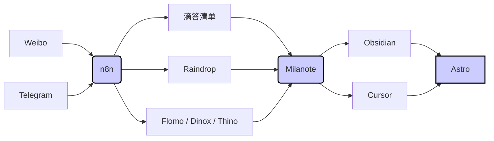

<!--section: 1-->

日期范围：2025-02-24 - 2025-03-02

<!--section: 2-->

## 1. 工作流的变化

<!--section: 2.1-->

### 1.1. 内容记录的位置

之前更换了 astro 的 template 之后，内容的 type 分为了 post 和 note 这两类，其中 post 主要指的是比较长和花心思写了的内容，而 note 就是一些比较碎片化的记录。  
我之前的内容输出是通过 quick add + template 快速添加一个文档来实现的，所以即使是碎片化的内容，也是单独的文档。  
  

也就是下图这种。

  

所以只能自己去写 dataview 来方便检索。  

不过这周又重新使用了 [thino](<https://github.com/Quorafind/Obsidian-Thino>) 插件，这个插件与 flomo 或者开源的 memo 类似，它把碎片化的记录写入到 obsidian 的日记中，这样既可以在插件中进行单独查看，也可以在日记中查看。  

然后当需要发布到其他平台的时候，才会把内容单独提取到一个文档里面，再修改 frontmatter 的信息。

### 1.2. 内容记录的方式

然后内容记录的方式也发生了改变，之前在 [Gingko Writer：在 AI 随便生成 20 万字的时代，“生而为人”该如何写作？](<https://blog.jimmylv.info/gingko-writer-human-writing-ai-generation-era/>) 这篇博文中第一次了解到 Gingko 这个软件。  

它使用树桩的视图来展示笔记内部的层级。让写作者专注于当前的这一个小节，从而提升输出的效率和专注率。  

我体验了一下，觉得确实有效果。不过我的主力编辑器还是 milanote + obsidian + vscode like ide, 不打算再使用其他的笔记软件记录增加管理负担，所以在体验之后就没有下文了。  

不过有一天心血来潮在网络上搜索了 obsidian + Gingko 的关键词，在论坛中搜索到了 [GitHub - ycnmhd/obsidian-lineage: Gingko-like interface in obsidian](<https://github.com/ycnmhd/obsidian-lineage>) 这个插件。  

它的完成度很高，在 obsidian 中实现了和 Gingko 一样的效果。      

大致的介绍如下：  

- 类 Gingko 视图：提供了一种类似 Gingko 的编辑界面，使得在 Obsidian 中进行结构化的 Markdown 编辑更加直观。适合编写长文的适合使用。
	- 
- 大纲视图：支持根据层级展示不同模块卡片。
	- 
- 支持自定义键盘快捷键，快速创建、删除、编辑卡片

在 obsidian 的第三方插件中可以直接搜索到 lineage


#obsidian #gingko #笔记软件 #写作  

在安装后，lineage 已经成为了我经常使用的插件。  

不过它默认的快捷键不太符合我的使用习惯。我修改了一下这个按键，在按下 esc 的时候自动保存，避免我无意中丢掉变更。


### 1.3. 重新梳理的输出的工作流

在 [建立人生仪表盘：2025年你将强的可怕！\_哔哩哔哩\_bilibili](<https://www.bilibili.com/video/BV1qe6HYhEBm/>) 还有数字游牧人的安利下，我购买了 milanote 这个白板工具。不过之前只是存放一些零散的资料，没有真的用起来。  

这周刚好比较有动力，所以就重新梳理了一下。  

以下是各大软件的之间的数据是如何流转的。  

大体思路社交平台作为最随意的入口，通过 n8n + rss 定时获取内容调接口写入到 raindrop 和 子弹笔记里面（目前用 thino 比较多），然后用 milanote 筛选一层，然后记录比较详细的个人的脑洞和想法，然后输出为项目或者企划，做进一步详细规划。

如果输出的形式是项目的话，就按照项目管理的形式去走。

如果输出的形式是长文，那么还是放到 obsidian 里面去写（搭配 lineage 插件），最后 git 提交后触发 github actions 部署到 cloudflare，另外如果要录视频就在长文的基础上改一版视频稿。

我个人感觉主动筛选这一层比较重要，如果碎片化的记录太多或者随手收集的东西太多，其实不容易留下印象，有效的信息太少了。



  

然后这是 milanote 中的大致目录结构。  


<!--section: 3-->

## 2. 使用大模型处理 `git diff` 生成 commit msg

流程如下：

1. **获取 git diff 信息：**
	* 可以使用 `git diff > git.diff` 将 diff 信息写入文件。
	* 可以使用 `git diff | clip` (Windows) 将 diff 信息复制到剪贴板。
2. **准备提示词：**
	* 提示词需要包含 commit 规则 [^1]。例子如下：

```
用户会输入git diff，请你生成commit msg，可以根据更改内容生成一些备注

我的commit规则：
module.exports = {
	rules: {
		'type-enum': [
			2,
			'always',
			[
				'feat', // 新功能
				'fix', // 修复
				'docs', // 文档变更
				'style', // 代码格式
				'refactor', // 重构
				'perf', // 性能优化
				'test', // 增加测试
				'chore', // 构建过程或辅助工具的变动
				'revert', // 回退
				'build', // 打包
			],
		],
		'type-case': [2, 'always', 'lower-case'],
		'type-empty': [2, 'never'],
		'scope-empty': [0],
		'scope-case': [0],
		'subject-full-stop': [0],
		'subject-case': [0],
		'header-max-length': [0],
	},
};
```

1. **发送给大模型：** 将 `git diff` 信息和提示词一起发送给大模型，获取 commit msg。
2. **使用 Cherry Studio (可选):**
	* 可以使用 Cherry Studio 创建 commit msg 生成助手

  
具体效果 


<!--section: 4-->

## 3. 收藏夹

<!--section: 4.1-->

### 3.1. Stripe Press

[Stripe Press — Ideas for progress](<https://press.stripe.com/>)  

一个很有设计感的网站，截图无法体现具体的细节，可以直接访问网站查看。

  


<!--section: 4.2-->

### 3.2. [Cherry Studio 官方网站 - 全能的AI助手](<https://cherry-ai.com/>)

Cherry Studio 已经成我的主力大模型客户端了，该有的体验都有，更新也很快。  

可以针对不同的场景定义系统提示词创建助手，也支持知识库、网络搜索等。

  

不过目前不太好的一点是同步的功能不太完善，可以通过网盘或者 webdav 同步，但是网盘只能手动备份和恢复。  

另外一个比较火的 chatwise 我还没有进行体验，有时间的时候会下载下来体验对比一下。  
