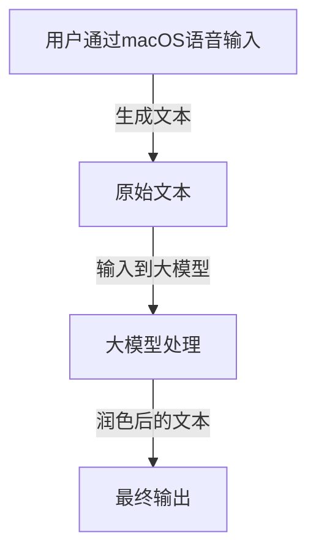

## 太长不看

步骤如下：  




---  

## 具体步骤

[在 Mac 上听写信息和文稿 - 官方 Apple 支持 (中国)](<https://support.apple.com/zh-cn/guide/mac-help/mh40584/mac>)

  
快捷键可以自己设置（搜索 “键盘” 进入入口），默认是按下两次 ctrl 键


实时识别的效果：  
  

Cherry Studio 自带的助手的提示词：  

``` plaintext
Using concise and clear language, please edit the following passage to improve its logical flow, eliminate any typographical errors. Be sure to maintain the original meaning of the text. The entire conversation and instructions should be provided in Chinese. Please begin by editing the following text: [语音文字输入].
```

最后的效果：

  
